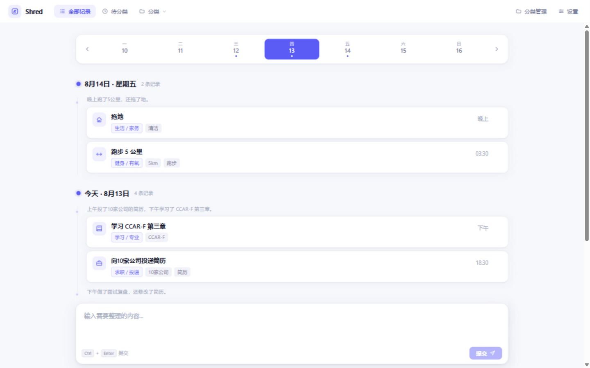

<div align="center">

# Shred

**把零散的中文记录，变成一眼可回看的时间线。**

用自然语言记下你做过的事，Shred 借助 LLM 自动拆分原子事件、解析时间、归类整理——像 macOS 生产力工具一样，安静地帮你回顾每一天。


</div>

## 展示 / Preview



输入一句 `上午做了面试复盘，把简历改了，还约了下周一的面试。`，Shred 会拆出三条记录、解析出"上午"、把"预约面试"记为当天完成的动作——并按日期排列成时间线。

## 特性 / Features

- 📝 **自然语言记录** — 用中文随意描述，`Ctrl + Enter` 提交，源文本完整保留
- ✂️ **LLM 自动整理** — 原子事件拆分、标题归一、相对时间解析（`昨天下午` → 昨天 15:00）、自动两级分类、最多 3 个标签
- 📅 **日期时间线** — 按"今天 / 昨天 / 日期 · 星期"分组，纵向时间线引导，最新在前
- 🗂 **分类治理** — 分类的创建、重命名、合并、删除，删除前展示影响范围
- 🧠 **偏好记忆** — 手动修正分类会被记住，后续分类自动参考；可一键清除
- ⏪ **安全撤销** — 分类结果 10 秒内可整组撤销，分类失败进入"待分类"安全重试
- 🔒 **本地优先** — 单容器部署、SQLite 存储、数据与密钥不出本机，JSON 一键导出
- 📱 **响应式 PWA** — 桌面端顶部导航 + 底部输入，移动端抽屉导航，可安装

## 快速开始 / Quick Start

需要 Docker 与 Docker Compose。

```bash
cp .env.example .env        # 首次：生成配置
# 编辑 .env，填入 SHRED_OPENAI_API_KEY 与 SHRED_MODEL
docker compose up -d
```

打开 **http://localhost:9400**，在底部输入框写下第一条记录。

> ⚠️ 修改 `.env` 后请使用 `docker compose up -d --force-recreate` 重建容器；
> `restart` 不会重新注入环境变量。

## 配置模型 / Model Configuration

| 变量 | 说明 | 默认值 |
|------|------|--------|
| `SHRED_OPENAI_API_KEY` | API 密钥（仅从本地环境读取，永不返回浏览器） | — |
| `SHRED_API_BASE_URL` | OpenAI 兼容端点 | `https://api.openai.com/v1` |
| `SHRED_MODEL` | 模型名称 | — |
| `SHRED_BIND_ADDRESS` | 监听地址 | `127.0.0.1` |
| `SHRED_PORT` | 端口 | `9400` |
| `SHRED_DATA_DIR` | 数据目录 | `./data` |

兼容 OpenAI、DeepSeek、Ollama、vLLM 等任何提供 `/v1/chat/completions` 的服务。
填写后可在页面「设置 → 测试连接」验证。

## 工作原理 / How It Works

```text
浏览器 / PWA
   │  同源 HTTP
   ▼
FastAPI 应用（单容器）
   ├─ 消息与事件服务       ← 先落库，再调用模型
   ├─ 分类治理服务
   ├─ 偏好记忆服务
   ├─ 分类器适配器 ────────→ 你配置的 OpenAI 兼容端点
   └─ 仓储层 ─────────────→ /data/shred.db
```

提交的消息**先持久化再调用模型**——模型超时或出错都不会丢失你的原文；
模型输出经过严格校验后才写入，任何非法结果进入"待分类"而不是污染数据。

## 数据与隐私 / Privacy

- 默认仅监听 `127.0.0.1`；局域网访问需显式开启且无内置认证
- 使用云端模型时，记录文本会发送到你配置的模型服务——请勿输入敏感信息
- API Key 只存在于后端进程环境变量中，不会显示在页面、日志或导出文件里
- 所有数据都在本地 `./data/shred.db`，备份 = 复制该文件；设置页可随时导出 JSON

## 技术栈 / Tech Stack

| 层 | 技术 |
|---|---|
| 前端 | React 19 · TypeScript · Vite · TanStack Query · Vitest · Playwright |
| 后端 | Python 3.12 · FastAPI · SQLAlchemy · Alembic · OpenAI SDK |
| 部署 | Docker Compose 单容器 · SQLite · PWA (workbox) |

## 开发 / Development

```bash
python -m venv .venv && ./.venv/Scripts/python.exe -m pip install -e ".[dev]"

# 后端测试（覆盖率门槛 85%，零警告）
./.venv/Scripts/python.exe -m pytest tests/backend -q

# 前端单元测试 / 覆盖率门槛 / 类型检查 / 构建
cd frontend && npm ci
npm run test:run          # 单元测试
npm run test:coverage     # 覆盖率报告（门槛见 vite.config.ts）
npx tsc --noEmit          # 类型检查
npm run build             # 生产构建（含 PWA）

# E2E：3 条浏览器 mock + 1 条真实后端链路（假分类器 + 独立测试库）
npx playwright test
```

E2E 的最后一条用例启动真实 FastAPI + SQLite 管线（`SHRED_E2E_FAKE_CLASSIFIER=1` 注入确定性假模型，
数据写入独立的 `data/e2e-test.db`），确保后端在真实进程里能跑起来。

## 真实模型验收 / Model Acceptance

分类质量（相对时间解析、分类树生成、偏好记忆）已用真实模型跑通验收
（deepseek-v4-flash，2026-08-13，**11/11 事件**）。更换模型后建议重跑：

| 输入 | 预期事件数 |
|---|---:|
| 龙珠改看完了 | 1 |
| 昨天下午做了一部分 CCAF-R 的测试 | 1 |
| 上午做了面试复盘，把简历改了，还约了下周一的面试。 | 3 |
| 饭吃了，快递取了，邮件回了。 | 3 |
| 拖地、浇花、关窗，都弄了。 | 3 |

验收要点：合计 11 个事件、源文本完整保留、相对时间正确、`预约面试` 记为当天完成的动作（非未来任务）、相关记录复用稳定分类。

## 非目标 / Non-Goals (v0.1)

- ❌ 多用户 / 账号体系 / 云同步
- ❌ 原生 iOS / Android 应用（仅 PWA）
- ❌ 任务、提醒、日历集成
- ❌ 全文搜索、统计报表、回顾摘要
- ❌ 图片 / 语音输入
- ❌ 向量数据库与模型训练

## 贡献 / Contributing

欢迎 Issues 与 PR。请保持：提交前跑通全部测试与覆盖率门槛、零警告、
不引入新的认证/云依赖。详细规划见 [`docs/superpowers/plans`](docs/superpowers/plans)。

## License

[MIT](LICENSE) © 一二三
